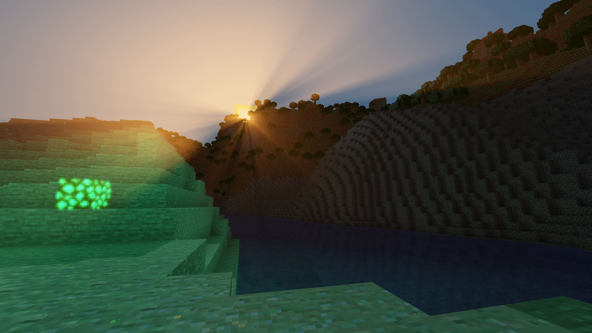

**Voxelite** was a student project for professor Dachsbacher's _Graphics & Game Development_ course at the Karlsruhe Institute of Technology (Computer Science M.Sc.).

It consists of a proposal, 4 sets of presentation slides, 8k lines of source code written in 3 months and was awarded the maximum grade.

## Goals

- Implement contemporary graphics techniques
    - Volumetric light scattering as post-process
    - Cascaded shadow mapping (+PCSS)
    - Physically-based rendering
    - Screen-space reflections
    - Ambient occlusion
    - Normal mapping
    - Transparency-compatible bloom
- Create an efficient OpenGL deferred voxel renderer
    - Asynchronous chunk meshing
    - Nine total culling methods
    - Texture atlas generation
    - Asynchronous transparency sorting
    - Mixed RGB flood-fill voxel lighting
- Generate procedural terrain
    - Parallel noise-based chunk generator
    - Spline tree for maximum configuration
    - Multiple biomes and structures
    - Practically unlimited world size

If you're thinking of a Minecraft clone - yes, pretty much that. We even stole the textures! Hopefully made up for that
with all our enhancements ;-)

### Non-goals

- Add gameplay elements beyond block placement
- Create a well-documented, impeccable codebase
- Cross-platform compatibility (Windows only)

## Dependencies

| Type                | Solution     |
| ------------------- | ------------- |
| Native bindings     | [LWJGL](https://github.com/LWJGL/lwjgl3)         |
| OpenGL abstraction  | [BeaconGL](https://github.com/ItsFlare/BeaconGL)      |
| User Interface      | [ImGui](https://github.com/SpaiR/imgui-java)         |
| 3D Noise            | [OpenSimplex2](https://github.com/KdotJPG/OpenSimplex2)  |
| Logging             | [Log4j](https://github.com/apache/logging-log4j2)         |
| Data Structures     | [FastUtil](https://github.com/vigna/fastutil)      |
| Testing             | [JUnit](https://github.com/junit-team/junit5) / [JMH](https://github.com/openjdk/jmh)   |
| Other               | [Gson](https://github.com/google/gson) / [Jansi](https://github.com/fusesource/jansi)  |

## Thanks
- Prof. Dr.-Ing. Carsten Dachsbacher
- Killian Herveau, M.Sc
- Reiner Dolp, M.Sc
- Baldur Karlsson ([renderdoc](https://github.com/baldurk/renderdoc))